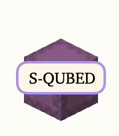

<h1 align="center">
    

        

            
        

        

            How Confident are Video Models?    Empowering Video
                Models to Express their Uncertainty 
        

    

</h1>

 
    <a 
    href="https://may0mei.github.io/">
        Zhiting&nbsp;Mei*</a>
    ,
    <a href="#">Ola&nbsp;Shorinwa*</a>,
    <a
        href="https://irom-lab.princeton.edu/majumdar/">
        Anirudha&nbsp;Majumdar</a>
    
                

    &#42;Equal Contribution.

  
  <h4 align="center">
  <a href="https://s-qubed.github.io/">Project Page</a> 
  | <a href= "https://www.arxiv.org/abs/2510.02571">arXiv</a>
  | <a href= "https://huggingface.co/datasets/s-qubed/s-qubed">Dataset</a> </h4>
  

 

Generative video models demonstrate impressive text-to-video capabilities, spurring widespread adoption in many real-world applications. However, like large language models (LLMs), video generation models tend to hallucinate, producing plausible videos even when they are factually wrong. Although uncertainty quantification (UQ) of LLMs has been extensively studied in prior work, _no UQ method for video models exists, raising critical safety concerns_. To our knowledge, this paper represents the first work towards quantifying the uncertainty of video models. We present a framework for uncertainty quantification of generative video models, consisting of a:

1. Metric for evaluating the calibration of video models based on robust rank correlation estimation with no stringent modeling assumptions;
2. Black-box UQ method for video models (termed **S-QUBED**), which leverages latent modeling to rigorously decompose predictive uncertainty into its aleatoric and epistemic components;
3. UQ dataset to facilitate benchmarking calibration in video models, which will be released after the review process.

By conditioning the generation task in the latent space, we disentangle uncertainty arising due to vague task specifications from that arising from lack of knowledge. Through extensive experiments on benchmark video datasets, we demonstrate that S-QUBED computes calibrated total uncertainty estimates that are negatively correlated with the task accuracy and effectively computes the aleatoric and epistemic constituents.